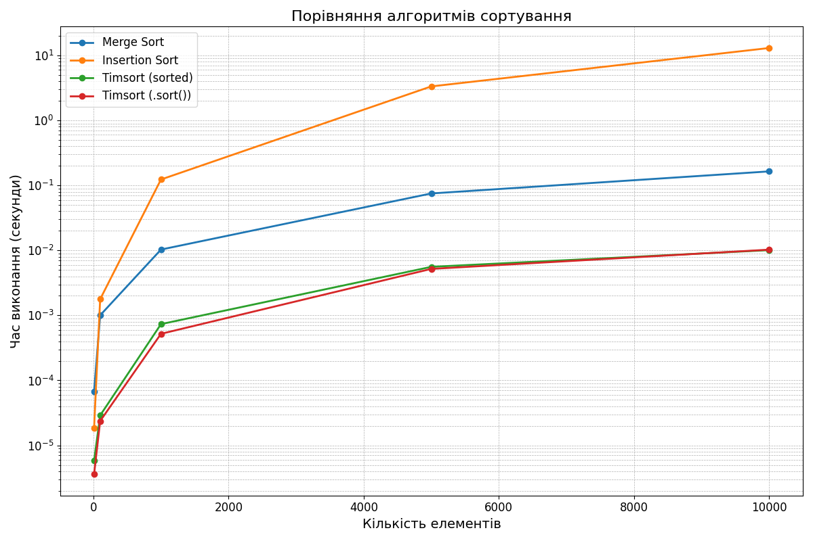

# Опис домашнього завдання

Python має дві вбудовані функції сортування: `sorted` і `sort`. Функції сортування Python використовують Timsort — гібридний алгоритм сортування, що поєднує в собі сортування злиттям і сортування вставками.
Порівняйте три алгоритми сортування: злиттям, вставками та Timsort за часом виконання. Аналіз повинен бути підтверджений емпіричними даними, отриманими шляхом тестування алгоритмів на різних наборах даних. Емпірично перевірте теоретичні оцінки складності алгоритмів, наприклад, сортуванням на великих масивах. Для заміру часу виконання алгоритмів використовуйте модуль `timeit`.
Покажіть, що поєднання сортування злиттям і сортування вставками робить алгоритм Timsort набагато ефективнішим, і саме з цієї причини програмісти, в більшості випадків, використовують вбудовані в Python алгоритми, а не кодують самі. Зробіть висновки.

## Графік часу виконання

## Висновки:

**Timsort** (`sorted` та `sort`) у Python є оптимальним вибором для всіх типів і розмірів масивів, тому краще використовуати вбудовані функції, якщо це можливо.
**Merge Sort** підходить для ситуацій, коли потрібно реалізувати власний алгоритм з хорошою продуктивністю.
**Insertion Sort** слід уникати використання для великих масивів, але він може бути корисним для дуже малих чи майже відсортованих даних.